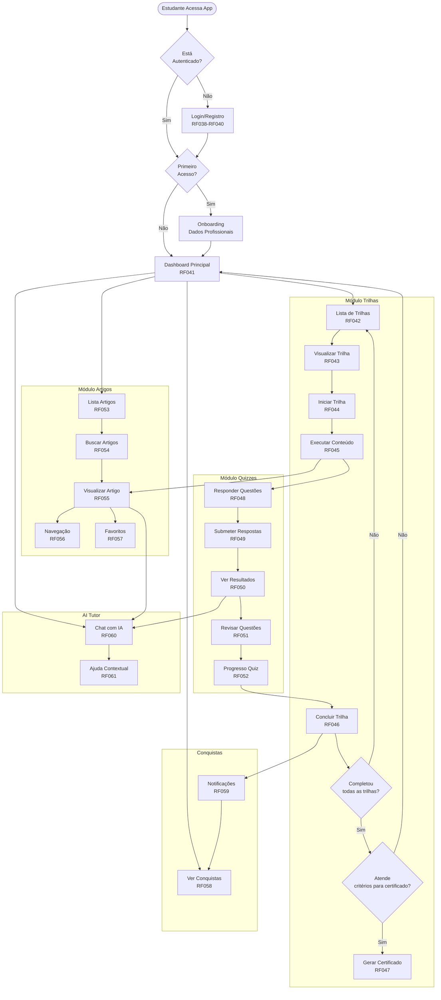
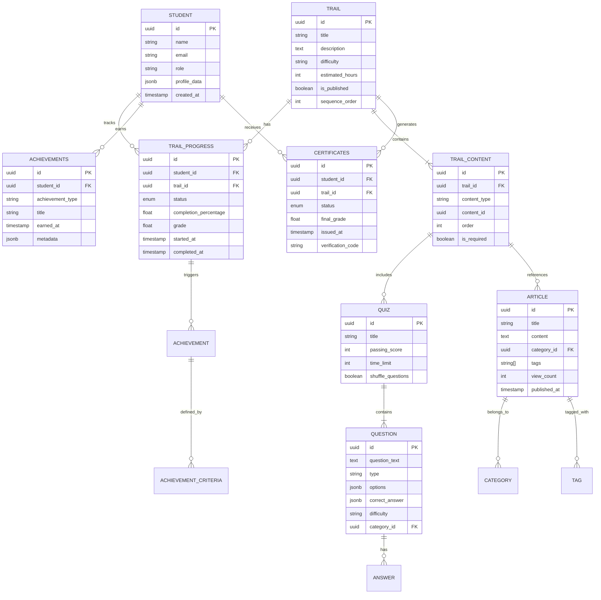
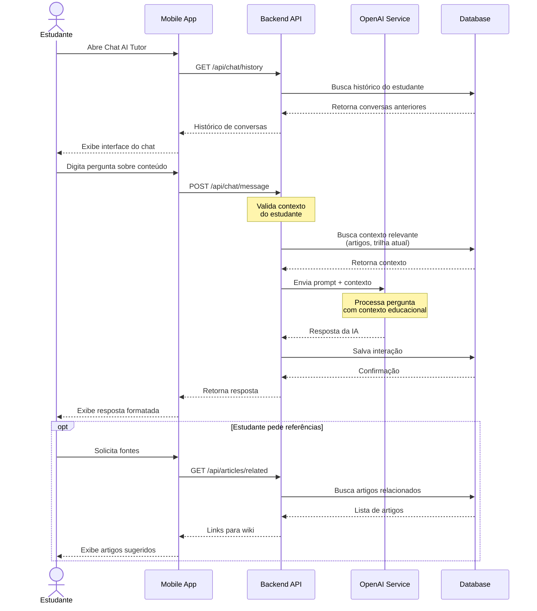
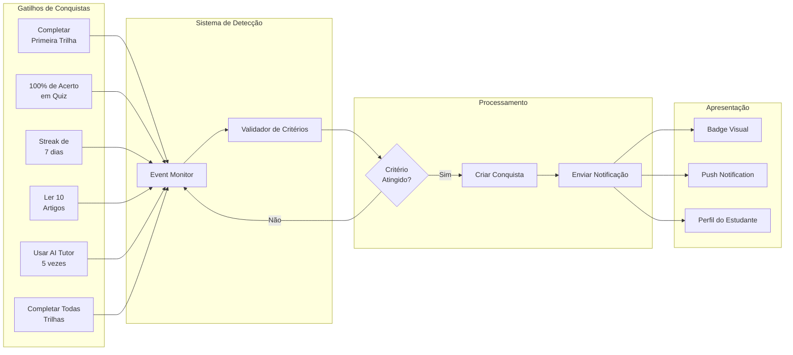
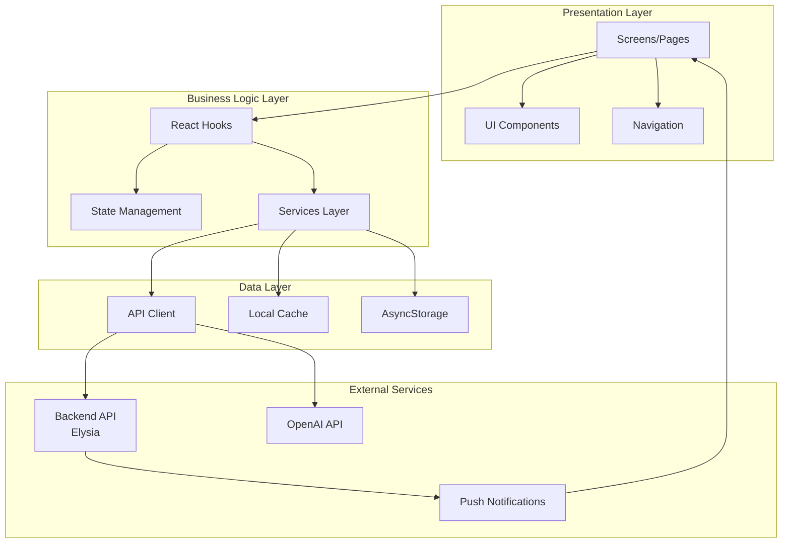
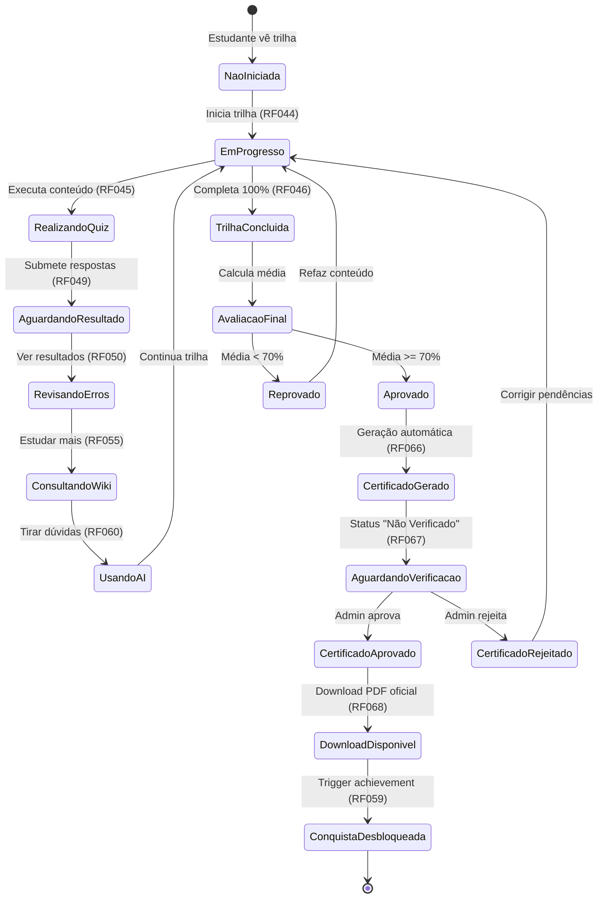
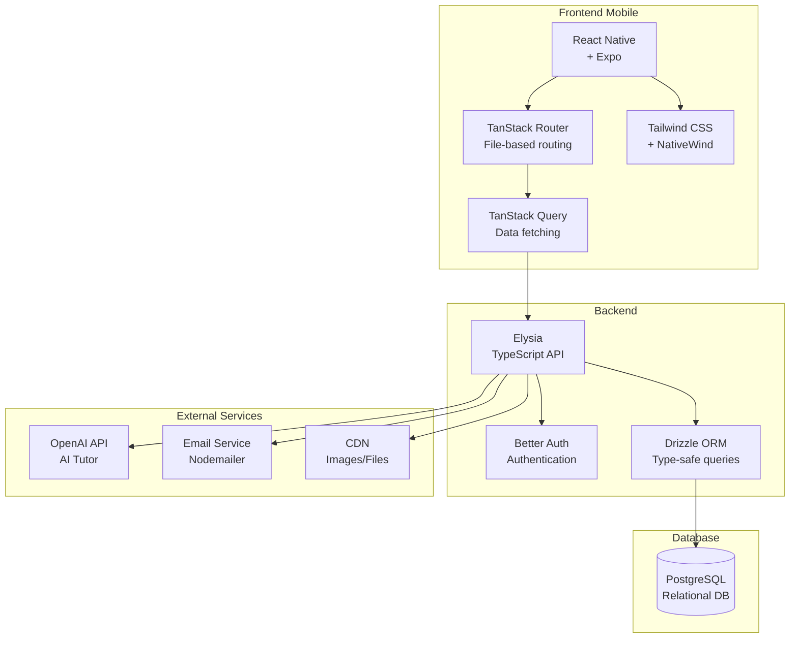

# MedWaster - Arquitetura dos Módulos do Estudante

Este diagrama apresenta a arquitetura dos módulos voltados para o estudante na plataforma MedWaster Learning.

## Visão Geral do Sistema

```mermaid graph TB
    subgraph "Mobile App - Estudante"
        AUTH[Autenticação<br/>RF038-RF040]
        DASH[Dashboard<br/>RF041]
        
        subgraph "Módulos de Aprendizagem"
            TRAILS[Trilhas<br/>RF042-RF047]
            ARTICLES[Artigos Wiki<br/>RF053-RF057]
            QUIZZES[Quizzes<br/>RF048-RF052]
            AI[AI Tutor<br/>RF060-RF061]
        end
        
        subgraph "Sistema de Gamificação"
            ACHIEVE[Conquistas<br/>RF058-RF059]
            PROGRESS[Progresso<br/>RF044-RF046]
        end
        
        subgraph "Certificação"
            CERT_REQ[Solicitação<br/>RF066]
            CERT_STATUS[Status<br/>RF067]
            CERT_DOWN[Download<br/>RF068]
        end
        
        PROFILE[Perfil<br/>RF062-RF064]
        SUPPORT[Suporte<br/>RF065]
    end
    
    AUTH --> DASH
    DASH --> TRAILS
    DASH --> ARTICLES
    DASH --> AI
    DASH --> ACHIEVE
    
    TRAILS --> QUIZZES
    TRAILS --> PROGRESS
    TRAILS --> CERT_REQ
    
    QUIZZES --> PROGRESS
    ARTICLES --> AI
    
    PROGRESS --> ACHIEVE
    PROGRESS --> CERT_REQ
    
    CERT_REQ --> CERT_STATUS
    CERT_STATUS --> CERT_DOWN
    
    DASH --> PROFILE
    DASH --> SUPPORT
```

## Fluxo Detalhado de Aprendizagem



## Arquitetura de Dados - Trilhas e Progresso



## Fluxo de Interação - AI Tutor



## Sistema de Conquistas (Achievements)



## Arquitetura de Camadas - Mobile App



## Fluxo Completo: Da Trilha ao Certificado



## Stack Tecnológico - Módulos do Estudante



## Resumo dos Módulos Principais

### 📚 **Artigos (Wiki)**
- **RF053-RF057**: Biblioteca de conhecimento sobre descarte de resíduos médicos
- Funcionalidades: Listagem, busca, visualização, navegação por categorias, favoritos
- Integração: Referenciado por trilhas, usado como contexto para AI Tutor

### 🛤️ **Trilhas (Learning Paths)**
- **RF042-RF047**: Sequências estruturadas de aprendizagem
- Funcionalidades: Navegação, progresso, conclusão, certificação
- Componentes: Quizzes, artigos, vídeos, conteúdo interativo

### 🤖 **AI Tutor**
- **RF060-RF061**: Assistente inteligente especializado
- Funcionalidades: Chat contextual, ajuda em tempo real, sugestões de conteúdo
- Tecnologia: OpenAI com contexto da trilha/artigo atual do estudante

### 📝 **Quizzes**
- **RF048-RF052**: Sistema de avaliação integrado às trilhas
- Tipos: Múltipla escolha, V/F, Completar, Associação
- Funcionalidades: Submissão, correção automática, revisão, feedback educativo

### 🏆 **Conquistas (Achievements)**
- **RF058-RF059**: Sistema de gamificação para engajamento
- Tipos: Conclusão de trilhas, streaks, perfeição em quizzes, exploração de conteúdo
- Apresentação: Badges, notificações, perfil público

### 📜 **Certificação**
- **RF066-RF068**: Emissão de certificados digitais
- Fluxo: Geração automática → Verificação admin → Download PDF oficial
- Validação: QR Code, assinatura digital, verificação online

---

**Tecnologias Core:**
- Frontend: React Native + Expo + TanStack Router
- Backend: Elysia + Better Auth + Drizzle ORM
- Database: PostgreSQL
- AI: OpenAI API
- Estilo: Tailwind CSS + NativeWind
