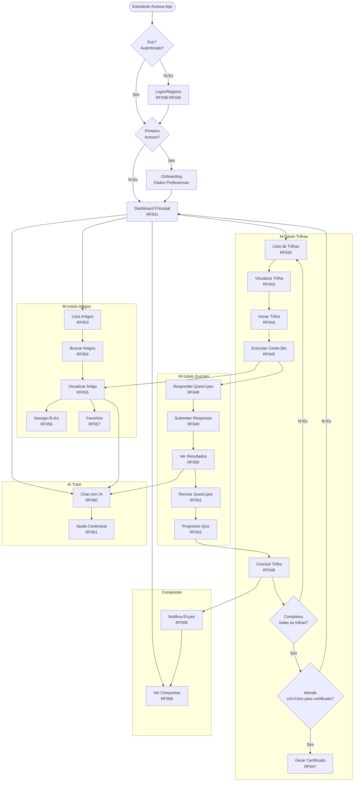
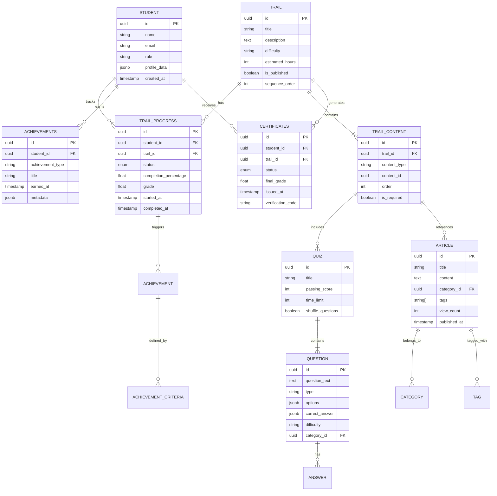
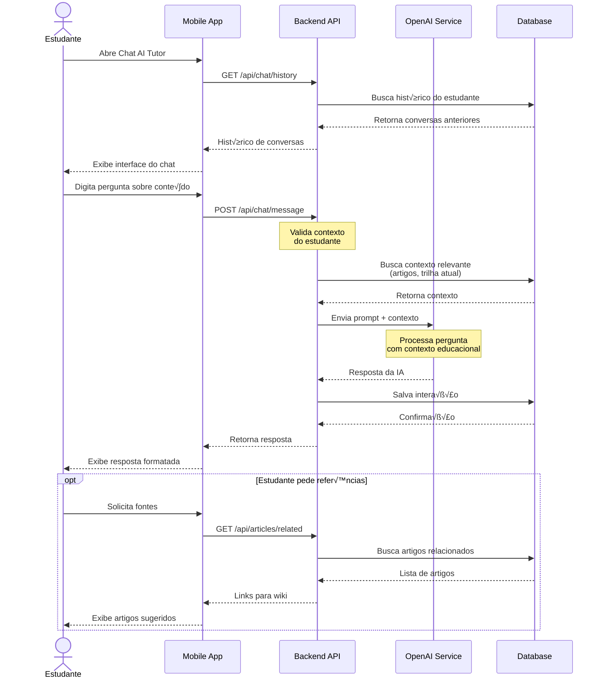
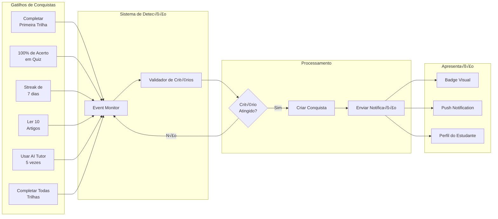
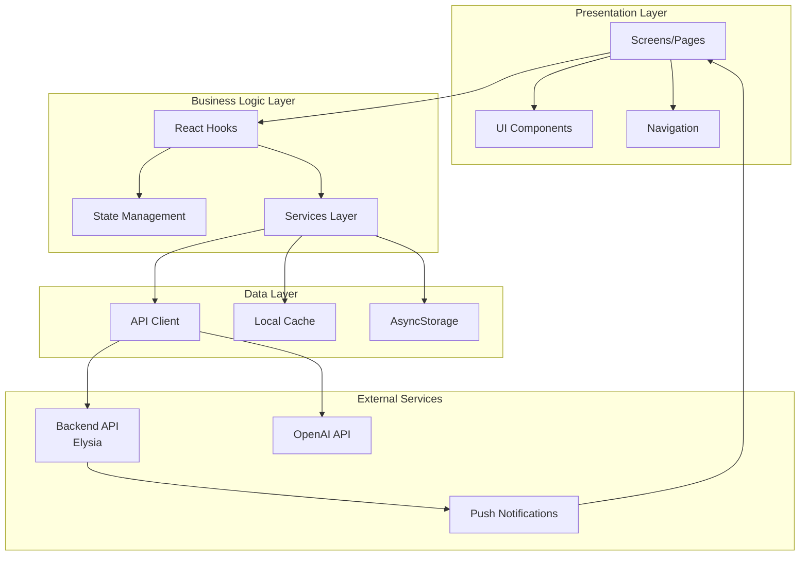
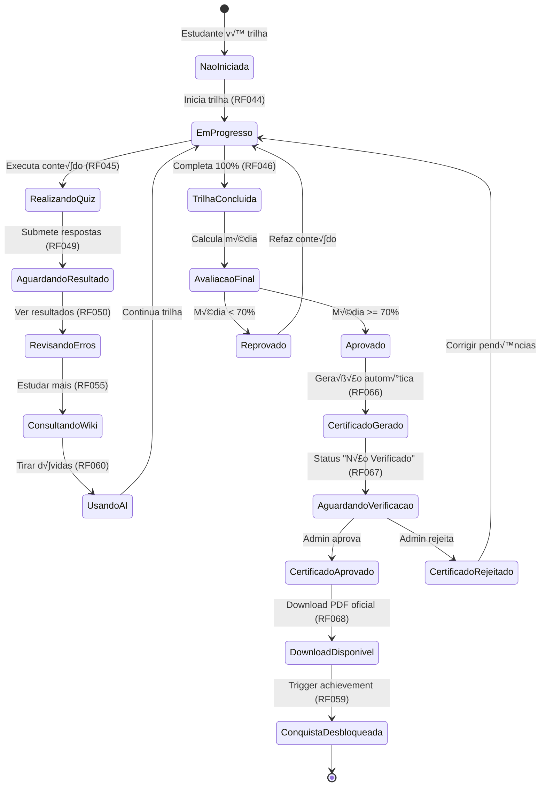
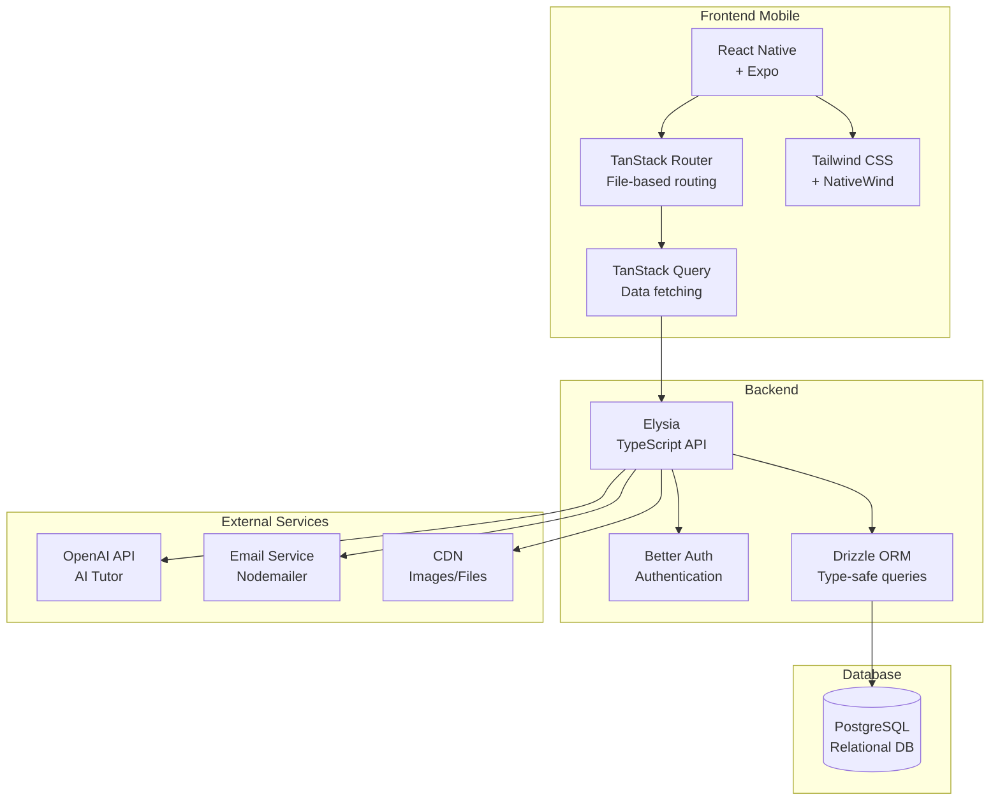

# MedWaster - Arquitetura dos Módulos do Estudante

Este diagrama apresenta a arquitetura dos módulos voltados para o estudante na plataforma MedWaster Learning.

## Vis√£o Geral do Sistema

```mermaid graph TB
    subgraph "Mobile App - Estudante"
        AUTH[Autenticação<br/>RF038-RF040]
        DASH[Dashboard<br/>RF041]
        
        subgraph "Módulos de Aprendizagem"
            TRAILS[Trilhas<br/>RF042-RF047]
            ARTICLES[Artigos Wiki<br/>RF053-RF057]
            QUIZZES[Quizzes<br/>RF048-RF052]
            AI[AI Tutor<br/>RF060-RF061]
        end
        
        subgraph "Sistema de Gamificação"
            ACHIEVE[Conquistas<br/>RF058-RF059]
            PROGRESS[Progresso<br/>RF044-RF046]
        end
        
        subgraph "Certificação"
            CERT_REQ[Solicitação<br/>RF066]
            CERT_STATUS[Status<br/>RF067]
            CERT_DOWN[Download<br/>RF068]
        end
        
        PROFILE[Perfil<br/>RF062-RF064]
        SUPPORT[Suporte<br/>RF065]
    end
    
    AUTH --> DASH
    DASH --> TRAILS
    DASH --> ARTICLES
    DASH --> AI
    DASH --> ACHIEVE
    
    TRAILS --> QUIZZES
    TRAILS --> PROGRESS
    TRAILS --> CERT_REQ
    
    QUIZZES --> PROGRESS
    ARTICLES --> AI
    
    PROGRESS --> ACHIEVE
    PROGRESS --> CERT_REQ
    
    CERT_REQ --> CERT_STATUS
    CERT_STATUS --> CERT_DOWN
    
    DASH --> PROFILE
    DASH --> SUPPORT
```

## Fluxo Detalhado de Aprendizagem

```mermaid
flowchart TD
    START([Estudante Acessa App])
    LOGIN{Est√°<br/>Autenticado?}
    AUTH_FLOW[Login/Registro<br/>RF038-RF040]
    ONBOARD{Primeiro<br/>Acesso?}
    ONBOARD_FLOW[Onboarding<br/>Dados Profissionais]
    
    DASHBOARD[Dashboard Principal<br/>RF041]
    
    subgraph "Módulo Trilhas"
        TRAIL_LIST[Lista de Trilhas<br/>RF042]
        TRAIL_VIEW[Visualizar Trilha<br/>RF043]
        TRAIL_START[Iniciar Trilha<br/>RF044]
        TRAIL_EXEC[Executar Conte√∫do<br/>RF045]
        TRAIL_COMPLETE[Concluir Trilha<br/>RF046]
        LAST_TRAIL_CHECK{Completou<br/>todas as trilhas?}
        CERT_CONDITION{Atende<br/>critérios para certificado?}
        TRAIL_CERT[Gerar Certificado<br/>RF047]
    end
    
    subgraph "Módulo Quizzes"
        QUIZ_EXEC[Responder Questões<br/>RF048]
        QUIZ_SUBMIT[Submeter Respostas<br/>RF049]
        QUIZ_RESULT[Ver Resultados<br/>RF050]
        QUIZ_REVIEW[Revisar Questões<br/>RF051]
        QUIZ_PROGRESS[Progresso Quiz<br/>RF052]
    end
    
    subgraph "Módulo Artigos"
        WIKI_LIST[Lista Artigos<br/>RF053]
        WIKI_SEARCH[Buscar Artigos<br/>RF054]
        WIKI_VIEW[Visualizar Artigo<br/>RF055]
        WIKI_NAV[Navegação<br/>RF056]
        WIKI_FAV[Favoritos<br/>RF057]
    end
    
    subgraph "AI Tutor"
        AI_CHAT[Chat com IA<br/>RF060]
        AI_HELP[Ajuda Contextual<br/>RF061]
    end
    
    subgraph "Conquistas"
        ACHIEVE_LIST[Ver Conquistas<br/>RF058]
        ACHIEVE_NOTIF[Notificações<br/>RF059]
    end
    
    START --> LOGIN
    LOGIN -->|N√£o| AUTH_FLOW
    LOGIN -->|Sim| ONBOARD
    AUTH_FLOW --> ONBOARD
    
    ONBOARD -->|Sim| ONBOARD_FLOW
    ONBOARD -->|N√£o| DASHBOARD
    ONBOARD_FLOW --> DASHBOARD
    
    DASHBOARD --> TRAIL_LIST
    DASHBOARD --> WIKI_LIST
    DASHBOARD --> ACHIEVE_LIST
    DASHBOARD --> AI_CHAT
    
    TRAIL_LIST --> TRAIL_VIEW
    TRAIL_VIEW --> TRAIL_START
    TRAIL_START --> TRAIL_EXEC
    
    TRAIL_EXEC --> QUIZ_EXEC
    QUIZ_EXEC --> QUIZ_SUBMIT
    QUIZ_SUBMIT --> QUIZ_RESULT
    QUIZ_RESULT --> QUIZ_REVIEW
    QUIZ_REVIEW --> QUIZ_PROGRESS
    
    TRAIL_EXEC --> WIKI_VIEW
    WIKI_LIST --> WIKI_SEARCH
    WIKI_SEARCH --> WIKI_VIEW
    WIKI_VIEW --> WIKI_NAV
    WIKI_VIEW --> WIKI_FAV
    
    WIKI_VIEW --> AI_CHAT
    QUIZ_RESULT --> AI_CHAT
    AI_CHAT --> AI_HELP
    
    QUIZ_PROGRESS --> TRAIL_COMPLETE
    TRAIL_COMPLETE --> LAST_TRAIL_CHECK
    LAST_TRAIL_CHECK -->|Sim| CERT_CONDITION
    LAST_TRAIL_CHECK -->|N√£o| TRAIL_LIST
    CERT_CONDITION -->|Sim| TRAIL_CERT
    CERT_CONDITION -->|N√£o| DASHBOARD
    
    TRAIL_COMPLETE --> ACHIEVE_NOTIF
    ACHIEVE_NOTIF --> ACHIEVE_LIST
```

## Arquitetura de Dados - Trilhas e Progresso

```mermaid
erDiagram
    STUDENT ||--o{ TRAIL_PROGRESS : tracks
    STUDENT ||--o{ ACHIEVEMENTS : earns
    STUDENT ||--o{ CERTIFICATES : receives
    
    TRAIL ||--o{ TRAIL_PROGRESS : has
    TRAIL ||--|{ TRAIL_CONTENT : contains
    TRAIL ||--o{ CERTIFICATES : generates
    
    TRAIL_CONTENT ||--o{ QUIZ : includes
    TRAIL_CONTENT ||--o{ ARTICLE : references
    
    QUIZ ||--|{ QUESTION : contains
    QUESTION ||--o{ ANSWER : has
    
    ARTICLE ||--o{ CATEGORY : belongs_to
    ARTICLE ||--o{ TAG : tagged_with
    
    ACHIEVEMENT ||--o{ ACHIEVEMENT_CRITERIA : defined_by
    TRAIL_PROGRESS ||--o{ ACHIEVEMENT : triggers
    
    STUDENT {
        uuid id PK
        string name
        string email
        string role
        jsonb profile_data
        timestamp created_at
    }
    
    TRAIL {
        uuid id PK
        string title
        text description
        string difficulty
        int estimated_hours
        boolean is_published
        int sequence_order
    }
    
    TRAIL_CONTENT {
        uuid id PK
        uuid trail_id FK
        string content_type
        uuid content_id
        int order
        boolean is_required
    }
    
    TRAIL_PROGRESS {
        uuid id PK
        uuid student_id FK
        uuid trail_id FK
        enum status
        float completion_percentage
        float grade
        timestamp started_at
        timestamp completed_at
    }
    
    QUIZ {
        uuid id PK
        string title
        int passing_score
        int time_limit
        boolean shuffle_questions
    }
    
    QUESTION {
        uuid id PK
        text question_text
        string type
        jsonb options
        jsonb correct_answer
        string difficulty
        uuid category_id FK
    }
    
    ARTICLE {
        uuid id PK
        string title
        text content
        uuid category_id FK
        string[] tags
        int view_count
        timestamp published_at
    }
    
    ACHIEVEMENTS {
        uuid id PK
        uuid student_id FK
        string achievement_type
        string title
        timestamp earned_at
        jsonb metadata
    }
    
    CERTIFICATES {
        uuid id PK
        uuid student_id FK
        uuid trail_id FK
        enum status
        float final_grade
        timestamp issued_at
        string verification_code
    }
```

## Fluxo de Interação - AI Tutor

```mermaid
sequenceDiagram
    actor Student as Estudante
    participant App as Mobile App
    participant API as Backend API
    participant AI as OpenAI Service
    participant DB as Database
    
    Student->>App: Abre Chat AI Tutor
    App->>API: GET /api/chat/history
    API->>DB: Busca histórico do estudante
    DB-->>API: Retorna conversas anteriores
    API-->>App: Histórico de conversas
    App-->>Student: Exibe interface do chat
    
    Student->>App: Digita pergunta sobre conte√∫do
    App->>API: POST /api/chat/message
    Note over API: Valida contexto<br/>do estudante
    
    API->>DB: Busca contexto relevante<br/>(artigos, trilha atual)
    DB-->>API: Retorna contexto
    
    API->>AI: Envia prompt + contexto
    Note over AI: Processa pergunta<br/>com contexto educacional
    AI-->>API: Resposta da IA
    
    API->>DB: Salva interação
    DB-->>API: Confirmação
    
    API-->>App: Retorna resposta
    App-->>Student: Exibe resposta formatada
    
    opt Estudante pede referências
        Student->>App: Solicita fontes
        App->>API: GET /api/articles/related
        API->>DB: Busca artigos relacionados
        DB-->>API: Lista de artigos
        API-->>App: Links para wiki
        App-->>Student: Exibe artigos sugeridos
    end
```

## Sistema de Conquistas (Achievements)

```mermaid
graph LR
    subgraph "Gatilhos de Conquistas"
        T1[Completar<br/>Primeira Trilha]
        T2[100% de Acerto<br/>em Quiz]
        T3[Streak de<br/>7 dias]
        T4[Ler 10<br/>Artigos]
        T5[Usar AI Tutor<br/>5 vezes]
        T6[Completar Todas<br/>Trilhas]
    end
    
    subgraph "Sistema de Detecção"
        MONITOR[Event Monitor]
        VALIDATOR[Validador de Critérios]
    end
    
    subgraph "Processamento"
        CHECK{Critério<br/>Atingido?}
        CREATE[Criar Conquista]
        NOTIFY[Enviar Notificação]
    end
    
    subgraph "Apresentação"
        BADGE[Badge Visual]
        NOTIF[Push Notification]
        PROFILE[Perfil do Estudante]
    end
    
    T1 --> MONITOR
    T2 --> MONITOR
    T3 --> MONITOR
    T4 --> MONITOR
    T5 --> MONITOR
    T6 --> MONITOR
    
    MONITOR --> VALIDATOR
    VALIDATOR --> CHECK
    
    CHECK -->|Sim| CREATE
    CHECK -->|N√£o| MONITOR
    
    CREATE --> NOTIFY
    NOTIFY --> BADGE
    NOTIFY --> NOTIF
    NOTIFY --> PROFILE
```

## Arquitetura de Camadas - Mobile App

```mermaid
graph TB
    subgraph "Presentation Layer"
        SCREENS[Screens/Pages]
        COMPONENTS[UI Components]
        NAVIGATION[Navigation]
    end
    
    subgraph "Business Logic Layer"
        HOOKS[React Hooks]
        STORES[State Management]
        SERVICES[Services Layer]
    end
    
    subgraph "Data Layer"
        API_CLIENT[API Client]
        CACHE[Local Cache]
        PERSISTENCE[AsyncStorage]
    end
    
    subgraph "External Services"
        BACKEND[Backend API<br/>Elysia]
        AI_SERVICE[OpenAI API]
        PUSH[Push Notifications]
    end
    
    SCREENS --> COMPONENTS
    SCREENS --> NAVIGATION
    SCREENS --> HOOKS
    
    HOOKS --> STORES
    HOOKS --> SERVICES
    
    SERVICES --> API_CLIENT
    SERVICES --> CACHE
    SERVICES --> PERSISTENCE
    
    API_CLIENT --> BACKEND
    API_CLIENT --> AI_SERVICE
    
    BACKEND --> PUSH
    PUSH --> SCREENS
```

## Fluxo Completo: Da Trilha ao Certificado

```mermaid
stateDiagram-v2
    [*] --> NaoIniciada: Estudante vê trilha
    
    NaoIniciada --> EmProgresso: Inicia trilha (RF044)
    
    EmProgresso --> RealizandoQuiz: Executa conte√∫do (RF045)
    RealizandoQuiz --> AguardandoResultado: Submete respostas (RF049)
    AguardandoResultado --> RevisandoErros: Ver resultados (RF050)
    RevisandoErros --> ConsultandoWiki: Estudar mais (RF055)
    ConsultandoWiki --> UsandoAI: Tirar d√∫vidas (RF060)
    UsandoAI --> EmProgresso: Continua trilha
    
    EmProgresso --> TrilhaConcluida: Completa 100% (RF046)
    
    TrilhaConcluida --> AvaliacaoFinal: Calcula média
    
    state AvaliacaoFinal <<choice>>
    AvaliacaoFinal --> Aprovado: Média >= 70%
    AvaliacaoFinal --> Reprovado: Média < 70%
    
    Reprovado --> EmProgresso: Refaz conte√∫do
    
    Aprovado --> CertificadoGerado: Geração automática (RF066)
    CertificadoGerado --> AguardandoVerificacao: Status "N√£o Verificado" (RF067)
    
    AguardandoVerificacao --> CertificadoAprovado: Admin aprova
    AguardandoVerificacao --> CertificadoRejeitado: Admin rejeita
    
    CertificadoRejeitado --> EmProgresso: Corrigir pendências
    
    CertificadoAprovado --> DownloadDisponivel: Download PDF oficial (RF068)
    DownloadDisponivel --> ConquistaDesbloqueada: Trigger achievement (RF059)
    
    ConquistaDesbloqueada --> [*]
```

## Stack Tecnológico - Módulos do Estudante

```mermaid
graph TB
    subgraph "Frontend Mobile"
        RN[React Native<br/>+ Expo]
        TR[TanStack Router<br/>File-based routing]
        TQ[TanStack Query<br/>Data fetching]
        TW[Tailwind CSS<br/>+ NativeWind]
    end
    
    subgraph "Backend"
        ELYSIA[Elysia<br/>TypeScript API]
        BA[Better Auth<br/>Authentication]
        DRIZZLE[Drizzle ORM<br/>Type-safe queries]
    end
    
    subgraph "Database"
        PG[(PostgreSQL<br/>Relational DB)]
    end
    
    subgraph "External Services"
        OPENAI[OpenAI API<br/>AI Tutor]
        EMAIL[Email Service<br/>Nodemailer]
        CDN[CDN<br/>Images/Files]
    end
    
    RN --> TR
    TR --> TQ
    TQ --> ELYSIA
    RN --> TW
    
    ELYSIA --> BA
    ELYSIA --> DRIZZLE
    ELYSIA --> OPENAI
    ELYSIA --> EMAIL
    
    DRIZZLE --> PG
    
    ELYSIA --> CDN
```

## Resumo dos Módulos Principais

### üìö **Artigos (Wiki)**
- **RF053-RF057**: Biblioteca de conhecimento sobre descarte de resíduos médicos
- Funcionalidades: Listagem, busca, visualização, navegação por categorias, favoritos
- Integração: Referenciado por trilhas, usado como contexto para AI Tutor

### 🛤️ **Trilhas (Learning Paths)**
- **RF042-RF047**: Sequências estruturadas de aprendizagem
- Funcionalidades: Navegação, progresso, conclusão, certificação
- Componentes: Quizzes, artigos, vídeos, conteúdo interativo

### 🤖 **AI Tutor**
- **RF060-RF061**: Assistente inteligente especializado
- Funcionalidades: Chat contextual, ajuda em tempo real, sugestões de conteúdo
- Tecnologia: OpenAI com contexto da trilha/artigo atual do estudante

### üìù **Quizzes**
- **RF048-RF052**: Sistema de avaliação integrado às trilhas
- Tipos: Múltipla escolha, V/F, Completar, Associação
- Funcionalidades: Submissão, correção automática, revisão, feedback educativo

### 🏆 **Conquistas (Achievements)**
- **RF058-RF059**: Sistema de gamificação para engajamento
- Tipos: Conclusão de trilhas, streaks, perfeição em quizzes, exploração de conteúdo
- Apresentação: Badges, notificações, perfil público

### 📜 **Certificação**
- **RF066-RF068**: Emiss√£o de certificados digitais
- Fluxo: Geração automática → Verificação admin → Download PDF oficial
- Validação: QR Code, assinatura digital, verificação online

---

**Tecnologias Core:**
- Frontend: React Native + Expo + TanStack Router
- Backend: Elysia + Better Auth + Drizzle ORM
- Database: PostgreSQL
- AI: OpenAI API
- Estilo: Tailwind CSS + NativeWind
