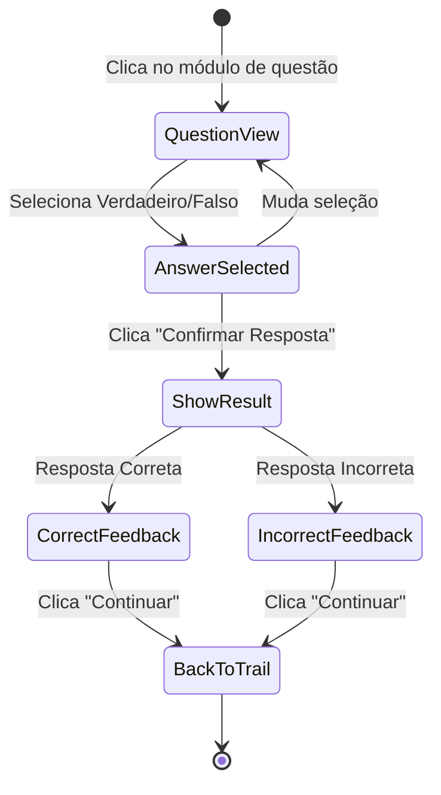

# Implementação de Questão Verdadeiro/Falso

## 📋 Visão Geral

Implementação de um componente de questão Verdadeiro/Falso (V/F) integrado às trilhas de aprendizagem, seguindo o design fornecido.

## 🎯 Funcionalidades Implementadas

### 1. **Tela de Questão (`/app/(app)/questions/[id].tsx`)**

#### Layout
- **Header**: Botão de voltar + label "VERDADEIRO OU FALSO"
- **Pergunta Centralizada**: Texto grande e legível no centro da tela
- **Dois Botões de Resposta**: 
  - Verdadeiro (topo)
  - Falso (baixo)
- **Botão de Confirmação**: Aparece após seleção

#### Estados Visuais

1. **Estado Inicial (Não Respondido)**
   - Botões brancos com borda cinza
   - Botão "Confirmar Resposta" desabilitado (cinza)

2. **Estado Selecionado (Antes de Confirmar)**
   - Botão selecionado: Azul (primary)
   - Botão não selecionado: Branco com borda cinza
   - Botão "Confirmar Resposta" ativo (azul)

3. **Estado Respondido - Correto**
   - Botão selecionado: Verde
   - Card de feedback verde aparece acima dos botões
   - Ícone de check ✓ no card
   - Explicação educativa exibida
   - Botão muda para "Continuar"

4. **Estado Respondido - Incorreto**
   - Botão selecionado: Vermelho
   - Card de feedback vermelho aparece
   - Ícone de X no card
   - Explicação educativa sobre a resposta correta
   - Botão muda para "Continuar"

### 2. **Integração com Trilhas**

#### Modificações em `trails/[id].tsx`

```typescript
const handleModulePress = () => {
  if (module.status === "locked") return;
  
  if (module.type === "article" && "resourceLink" in module) {
    router.push(`/${module.resourceLink}` as any);
  } else if (module.type === "question") {
    router.push(`/(app)/questions/${module.id}` as any);
  }
};
```

Agora os módulos do tipo "question" navegam corretamente para a tela de questão.

### 3. **Dados Mock**

```typescript
const questionsData = {
  "3": {
    id: "3",
    type: "true-false",
    question: "Resíduos da Classe A (biológicos) devem ser descartados em sacos brancos leitosos?",
    correctAnswer: true,
    explanation: "Sim! De acordo com a RDC 222/2018 da ANVISA, resíduos do Grupo A (biológicos) devem ser acondicionados em sacos brancos leitosos, que são identificados com o símbolo de substância infectante.",
    trailId: "1",
  },
};
```

## 🎨 Design System

### Cores Utilizadas

```typescript
// Estados dos botões
- Não selecionado: bg-white border-gray-200
- Selecionado (antes de confirmar): bg-primary border-primary
- Correto: bg-green-500 border-green-600
- Incorreto: bg-red-500 border-red-600

// Cards de feedback
- Correto: bg-green-50 (fundo), text-green-900 (título), text-green-800 (texto)
- Incorreto: bg-red-50 (fundo), text-red-900 (título), text-red-800 (texto)

// Botão de confirmação
- Desabilitado: bg-gray-300 text-gray-500
- Ativo: bg-primary text-white
```

### Espaçamentos

- Padding da tela: `px-6`
- Gap entre botões: `gap-4`
- Padding dos botões: `py-6`
- Border radius dos botões: `rounded-3xl`
- Tamanho do texto da pergunta: `text-2xl`
- Tamanho do texto dos botões: `text-xl`

## 🔄 Fluxo de Interação



## 📱 Comportamento

### Responsividade
- Layout flexível que se adapta a diferentes tamanhos de tela
- ScrollView permite que conteúdo longo seja visualizado
- Pergunta sempre visível e centralizada

### Acessibilidade
- Textos grandes e legíveis
- Alto contraste entre estados
- Feedback visual claro (cores, ícones)
- Feedback educativo sempre presente

### Navegação
- Volta para a trilha após responder
- Botão de voltar no header
- Navegação consistente com o resto do app

## 🔮 Próximos Passos

### Backend Integration
1. Conectar com API para buscar questões reais
2. Salvar respostas do usuário
3. Registrar progresso na trilha
4. Atualizar estatísticas de acertos/erros

### Melhorias de UX
1. Animações de transição entre estados
2. Haptic feedback ao selecionar resposta
3. Confetti animation quando acertar
4. Sound effects (opcional)

### Novas Features
1. Explicação em vídeo/imagem
2. Links para artigos da wiki relacionados
3. Botão "Reportar erro na questão"
4. Histórico de tentativas
5. Temporizador (para quizzes com tempo)

### Tipos de Questão Adicionais
1. Múltipla escolha (2-5 alternativas)
2. Completar frase (lacunas)
3. Associação (relacionar colunas)
4. Ordenação (sequência correta)

## 🧪 Testando

### Como Testar Localmente

1. Inicie o app:
```bash
cd apps/native
bun run ios
```

2. Navegue até:
   - Home → Trilhas → "Descarte de Medicamentos"
   - Clique no módulo "Pergunta Rápida: Resíduos Classe A"

3. Teste os cenários:
   - ✅ Selecionar "Verdadeiro" (resposta correta)
   - ❌ Selecionar "Falso" (resposta incorreta)
   - 🔄 Mudar de resposta antes de confirmar
   - ➡️ Continuar após responder

### Casos de Teste

| Cenário | Ação | Resultado Esperado |
|---------|------|-------------------|
| Entrar na questão | Clicar no módulo | Tela de questão carregada |
| Selecionar resposta | Clicar em um botão | Botão fica azul |
| Mudar resposta | Clicar em outro botão | Novo botão azul, anterior volta ao branco |
| Confirmar sem selecionar | Clicar "Confirmar" | Botão permanece desabilitado |
| Confirmar resposta correta | Selecionar + Confirmar | Card verde aparece com explicação |
| Confirmar resposta incorreta | Selecionar + Confirmar | Card vermelho aparece com explicação |
| Continuar após responder | Clicar "Continuar" | Volta para a trilha |
| Voltar sem responder | Clicar no botão voltar | Retorna à trilha |

## 📂 Arquivos Modificados

1. **`apps/native/app/(app)/questions/[id].tsx`** - Componente principal da questão V/F
2. **`apps/native/app/(app)/(tabs)/trails/[id].tsx`** - Navegação para questões

## 🎓 Referências

- **RF056**: Sistema de Questões Interativas
- **RF008**: Criar Questão - Múltipla Escolha (base para estrutura)
- **RF009**: Criar Questão - Verdadeiro ou Falso (especificação)

## 📸 Screenshots Esperados

### Estado Inicial
```
┌─────────────────────────────────┐
│  ← [Voltar]                      │
│  VERDADEIRO OU FALSO             │
│                                  │
│                                  │
│     Resíduos da Classe A         │
│     (biológicos) devem ser       │
│     descartados em sacos         │
│     brancos leitosos?            │
│                                  │
│                                  │
│  ┌──────────────────────────┐   │
│  │      Verdadeiro          │   │
│  └──────────────────────────┘   │
│                                  │
│  ┌──────────────────────────┐   │
│  │         Falso            │   │
│  └──────────────────────────┘   │
│                                  │
│  [  Confirmar Resposta  ] (gray)│
└─────────────────────────────────┘
```

### Estado Respondido Correto
```
┌─────────────────────────────────┐
│  ← [Voltar]                      │
│  VERDADEIRO OU FALSO             │
│                                  │
│  ┌──────────────────────────┐   │
│  │ ✓ Correto!               │   │
│  │ Sim! De acordo com a     │   │
│  │ RDC 222/2018...          │   │
│  └──────────────────────────┘   │
│                                  │
│  ┌──────────────────────────┐   │
│  │    Verdadeiro (VERDE)    │   │
│  └──────────────────────────┘   │
│                                  │
│  ┌──────────────────────────┐   │
│  │         Falso            │   │
│  └──────────────────────────┘   │
│                                  │
│  [     Continuar     ] (azul)   │
└─────────────────────────────────┘
```

---

**Status**: ✅ Implementação completa e funcional
**Última atualização**: 2025-10-21
