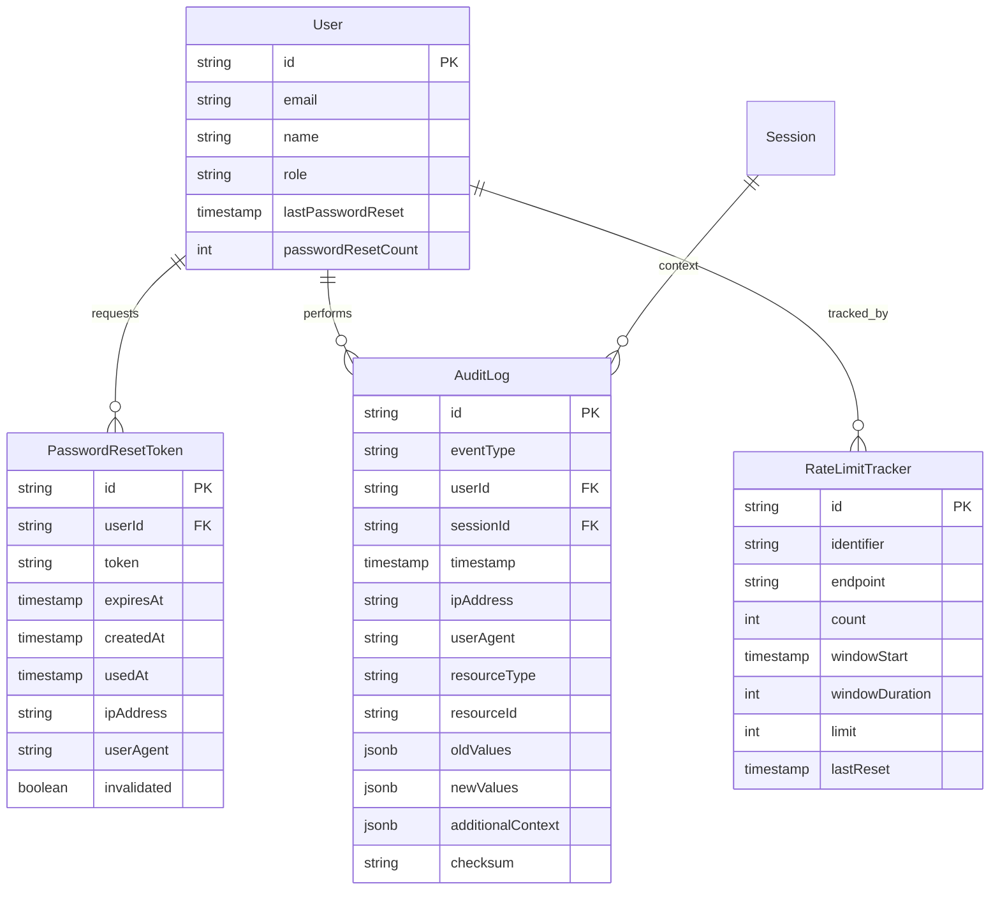

# Data Model: Password Recovery and Audit Logging

# Data Model: Password Recovery and Audit Logging

## Core Entities

### Email Service Configuration
Configuration for SMTP email delivery within Better Auth's sendResetPassword callback.

**Attributes**:
- `host`: SMTP server hostname
- `port`: SMTP server port  
- `secure`: TLS/SSL connection flag
- `auth`: SMTP authentication credentials
- `from`: Default sender information

**Business Rules**:
- Configuration loaded from environment variables
- Email templates use existing forget-password.tsx
- Better Auth handles all token management automatically
- SMTP integration only handles email delivery

**Implementation**:
Better Auth provides the reset URL with embedded token - no custom token management needed.

### Audit Log Entry  
Immutable record of security-sensitive events and user actions (unchanged from previous design).

**Attributes**:
- `id`: Unique identifier (UUID/ULID)
- `eventType`: Categorized event type (enum)
- `userId`: User who performed action (nullable for anonymous events)
- `sessionId`: Session context (nullable)
- `timestamp`: When event occurred (indexed)
- `ipAddress`: Client IP address
- `userAgent`: Browser/client information
- `resourceType`: Type of resource affected (user, session, etc.)
- `resourceId`: ID of specific resource
- `oldValues`: Previous state (JSONB, nullable)
- `newValues`: New state (JSONB, nullable)  
- `additionalContext`: Event-specific metadata (JSONB)
- `checksum`: Tamper-detection hash

**Enhanced Event Types for Better Auth**:
```typescript
enum AuditEventType {
  // Authentication Events (existing)
  LOGIN_SUCCESS = 'login_success',
  LOGIN_FAILURE = 'login_failure',
  LOGOUT = 'logout',
  SESSION_EXPIRED = 'session_expired',
  
  // Password Events (Better Auth integration)
  PASSWORD_RESET_REQUESTED = 'password_reset_requested',    // From sendResetPassword callback
  PASSWORD_RESET_EMAIL_FAILED = 'password_reset_email_failed', // Email delivery failure
  PASSWORD_RESET_COMPLETED = 'password_reset_completed',    // From onPasswordReset callback
  PASSWORD_RESET_TOKEN_INVALID = 'password_reset_token_invalid', // Better Auth validation failure
  
  // User Management (existing)
  USER_CREATED = 'user_created',
  USER_UPDATED = 'user_updated',
  USER_ROLE_CHANGED = 'user_role_changed',
  USER_BANNED = 'user_banned',
  USER_UNBANNED = 'user_unbanned',
  
  // Administrative Actions (existing)
  AUDIT_LOG_ACCESSED = 'audit_log_accessed',
  SYSTEM_CONFIG_CHANGED = 'system_config_changed'
}
```

### Rate Limit Monitor
Enhanced monitoring on top of Better Auth's built-in rate limiting.

**Attributes**:
- `id`: Unique identifier
- `identifier`: User ID or IP address
- `endpoint`: Monitored endpoint (password-reset, login)
- `attemptCount`: Number of attempts in current window
- `windowStart`: Beginning of monitoring window
- `lastAttempt`: Most recent attempt timestamp
- `alertThreshold`: When to trigger security alerts

**Business Rules**:
- Monitors Better Auth's built-in rate limiting
- Generates alerts for suspicious patterns
- Tracks across server restarts
- Integrates with audit logging

## Database Schema

### No Password Reset Token Table Needed
Better Auth uses the existing `verification` table for password reset tokens. We don't need custom token management.

### Enhanced Audit Schema (Updated)
```typescript
// apps/server/src/db/schema/audit.ts - Updated for Better Auth
import { pgTable, text, timestamp, jsonb, integer, index } from "drizzle-orm/pg-core";

export const auditLog = pgTable("audit_log", {
  id: text("id").primaryKey(),
  eventType: text("event_type").notNull(),
  userId: text("user_id").references(() => user.id),
  sessionId: text("session_id").references(() => session.id),
  timestamp: timestamp("timestamp").defaultNow().notNull(),
  ipAddress: text("ip_address"),
  userAgent: text("user_agent"),
  resourceType: text("resource_type"),
  resourceId: text("resource_id"),
  oldValues: jsonb("old_values"),
  newValues: jsonb("new_values"),
  additionalContext: jsonb("additional_context"),
  checksum: text("checksum").notNull(),
}, (table) => ({
  timestampIdx: index("idx_audit_timestamp").on(table.timestamp),
  userIdx: index("idx_audit_user").on(table.userId),
  eventTypeIdx: index("idx_audit_event_type").on(table.eventType),
}));

export const rateLimitMonitor = pgTable("rate_limit_monitor", {
  id: text("id").primaryKey(),
  identifier: text("identifier").notNull(),
  endpoint: text("endpoint").notNull(),
  attemptCount: integer("attempt_count").default(0),
  windowStart: timestamp("window_start").defaultNow().notNull(),
  lastAttempt: timestamp("last_attempt").defaultNow().notNull(),
  alertThreshold: integer("alert_threshold").default(10),
}, (table) => ({
  identifierEndpointIdx: index("idx_monitor_id_endpoint").on(table.identifier, table.endpoint),
}));
```

### Audit Log Entry
Immutable record of security-sensitive events and user actions.

**Attributes**:
- `id`: Unique identifier (UUID/ULID)
- `eventType`: Categorized event type (enum)
- `userId`: User who performed action (nullable for anonymous events)
- `sessionId`: Session context (nullable)
- `timestamp`: When event occurred (indexed)
- `ipAddress`: Client IP address
- `userAgent`: Browser/client information
- `resourceType`: Type of resource affected (user, session, etc.)
- `resourceId`: ID of specific resource
- `oldValues`: Previous state (JSONB, nullable)
- `newValues`: New state (JSONB, nullable)  
- `additionalContext`: Event-specific metadata (JSONB)
- `checksum`: Tamper-detection hash

**Event Types**:
```typescript
enum AuditEventType {
  // Authentication Events
  LOGIN_SUCCESS = 'login_success',
  LOGIN_FAILURE = 'login_failure',
  LOGOUT = 'logout',
  SESSION_EXPIRED = 'session_expired',
  
  // Password Events  
  PASSWORD_RESET_REQUESTED = 'password_reset_requested',
  PASSWORD_RESET_COMPLETED = 'password_reset_completed',
  PASSWORD_CHANGED = 'password_changed',
  
  // User Management
  USER_CREATED = 'user_created',
  USER_UPDATED = 'user_updated',
  USER_ROLE_CHANGED = 'user_role_changed',
  USER_BANNED = 'user_banned',
  USER_UNBANNED = 'user_unbanned',
  
  // Administrative Actions
  AUDIT_LOG_ACCESSED = 'audit_log_accessed',
  SYSTEM_CONFIG_CHANGED = 'system_config_changed'
}
```

**Business Rules**:
- All entries are immutable (no updates/deletes)
- Automatic 7-year retention with archival
- Super Admin access only
- GDPR anonymization for deleted users
- Checksum validation on retrieval

**Relationships**:
- Many-to-One with User (nullable for anonymous events)
- Many-to-One with Session (nullable)
- Self-contained entity (no foreign key dependencies on business data)

### Rate Limit Tracker
Tracks request rates for various endpoints to prevent abuse.

**Attributes**:
- `id`: Unique identifier  
- `identifier`: Tracking key (user_id, ip_address, etc.)
- `endpoint`: Rate-limited endpoint/action
- `count`: Current request count
- `windowStart`: Beginning of current time window
- `windowDuration`: Length of rate limit window
- `limit`: Maximum requests allowed in window
- `lastReset`: When counter was last reset

**Business Rules**:
- Sliding window rate limiting
- Different limits per endpoint type
- Automatic window reset
- Memory + database persistence

**Rate Limits**:
- Password reset: 5 requests/hour per user
- Failed logins: 10 attempts/hour per IP  
- Audit queries: 100 requests/minute per admin user

## Database Schema

### Extensions to Existing Auth Schema

```typescript
// apps/server/src/db/schema/auth.ts
// Add to existing user table
export const user = pgTable("user", {
  // ... existing fields ...
  lastPasswordReset: timestamp("last_password_reset"),
  passwordResetCount: integer("password_reset_count").default(0),
});

// Extend verification table or create dedicated table
export const passwordResetToken = pgTable("password_reset_token", {
  id: text("id").primaryKey(),
  userId: text("user_id").notNull().references(() => user.id, { onDelete: "cascade" }),
  token: text("token").notNull().unique(),
  expiresAt: timestamp("expires_at").notNull(),
  createdAt: timestamp("created_at").defaultNow().notNull(),
  usedAt: timestamp("used_at"),
  ipAddress: text("ip_address"),
  userAgent: text("user_agent"),
  invalidated: boolean("invalidated").default(false),
});
```

### New Audit Schema

```typescript
// apps/server/src/db/schema/audit.ts
import { pgTable, text, timestamp, jsonb, integer } from "drizzle-orm/pg-core";

export const auditLog = pgTable("audit_log", {
  id: text("id").primaryKey(),
  eventType: text("event_type").notNull(),
  userId: text("user_id").references(() => user.id),
  sessionId: text("session_id").references(() => session.id),
  timestamp: timestamp("timestamp").defaultNow().notNull(),
  ipAddress: text("ip_address"),
  userAgent: text("user_agent"),
  resourceType: text("resource_type"),
  resourceId: text("resource_id"),
  oldValues: jsonb("old_values"),
  newValues: jsonb("new_values"),
  additionalContext: jsonb("additional_context"),
  checksum: text("checksum").notNull(),
}, (table) => ({
  timestampIdx: index("idx_audit_timestamp").on(table.timestamp),
  userIdx: index("idx_audit_user").on(table.userId),
  eventTypeIdx: index("idx_audit_event_type").on(table.eventType),
}));

export const rateLimitTracker = pgTable("rate_limit_tracker", {
  id: text("id").primaryKey(),
  identifier: text("identifier").notNull(),
  endpoint: text("endpoint").notNull(),
  count: integer("count").default(0),
  windowStart: timestamp("window_start").defaultNow().notNull(),
  windowDuration: integer("window_duration").notNull(), // seconds
  limit: integer("limit").notNull(),
  lastReset: timestamp("last_reset").defaultNow().notNull(),
}, (table) => ({
  identifierEndpointIdx: index("idx_rate_limit_id_endpoint").on(table.identifier, table.endpoint),
}));
```

## Entity Relationships



## Data Flow

### Password Reset Flow
1. User requests reset → Create `PasswordResetToken`
2. Email service sends link → Audit log: `PASSWORD_RESET_REQUESTED`
3. User clicks link → Validate token, update `usedAt`
4. Password changed → Audit log: `PASSWORD_RESET_COMPLETED`
5. Invalidate all other tokens → Clean up

### Audit Capture Flow
1. Middleware intercepts requests → Extract context
2. Business logic executes → Capture before/after state
3. Create `AuditLog` entry → Calculate checksum
4. Persist immutably → Index for queries

### Rate Limit Check Flow  
1. Request arrives → Identify user/IP
2. Query `RateLimitTracker` → Check current count
3. Increment or reject → Update/create tracker
4. Window expires → Reset counter

## Data Retention & Archival

### Audit Logs
- **Active Period**: 1 year (fast queries)
- **Archive Period**: 6 years (compressed storage)
- **Deletion**: After 7 years or GDPR request
- **Anonymization**: Replace user references with hash

### Password Reset Tokens
- **Active Period**: 1 hour (until expiration)
- **Retention**: 30 days (for audit trail)
- **Cleanup**: Automated background job

### Rate Limit Trackers
- **Active Period**: Duration of window
- **Cleanup**: Immediate after window expires
- **Persistence**: Only for cross-restart consistency