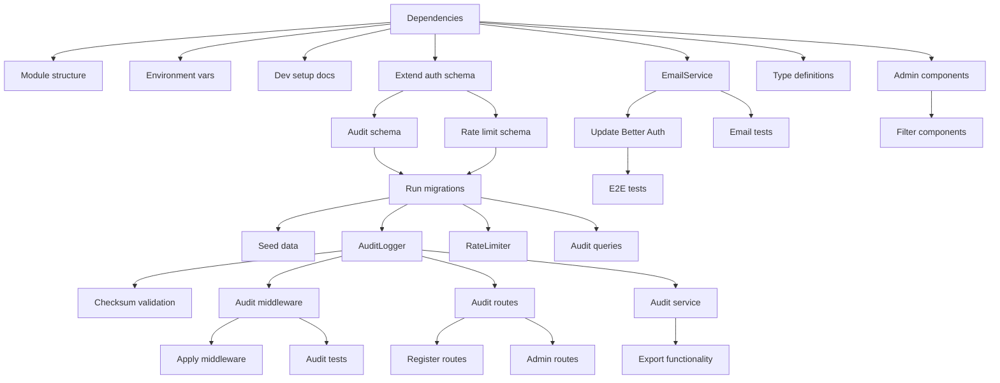

# Tasks: Password Recovery and Audit Logging

**Input**: Design documents from `/specs/002-complete-the-password/`
**Prerequisites**: plan.md ✅, research.md ✅, data-model.md ✅, contracts/ ✅

## Summary
Implement password recovery functionality by completing Better Auth email integration and create comprehensive audit logging system for MedWaster Learning. Focus on server-side implementation with admin interface additions.

**Tech Stack**: TypeScript 5.x, Bun runtime, Elysia, Better Auth, Drizzle ORM, React Email, Nodemailer, Zod
**Primary Workspace**: `apps/server` (with minor `apps/web` additions)
**Estimated Total**: 26 tasks across 7 phases (reduced due to Better Auth built-ins)
**Architecture Pattern**: Elysia MVC + Better Auth integration (no custom password reset endpoints needed)

## Phase 3.1: Setup & Dependencies (4 tasks)
- [ ] **T001** Install email and audit dependencies in `apps/server/package.json` (zod nodemailer @types/nodemailer crypto-js date-fns)
- [ ] **T002** [P] Create audit module MVC structure in `apps/server/src/modules/audit/` (controller, service, validators, queries files)
- [ ] **T003** [P] Add environment variables to `apps/server/.env.example` for SMTP configuration
- [ ] **T004** [P] Set up development SMTP server documentation in quickstart

## Phase 3.2: Database & Schema (3 tasks)  
- [ ] **T005** [P] Create audit log schema in `apps/server/src/db/schema/audit.ts`
- [ ] **T006** [P] Create rate limit monitor schema in `apps/server/src/db/schema/audit.ts`
- [ ] **T007** Generate and apply database migrations for new schemas

## Phase 3.3: Core Services & Validators (7 tasks)
- [ ] **T008** [P] Create audit validators in `apps/server/src/modules/audit/audit.validators.ts` with Zod schemas
- [ ] **T009** [P] Implement EmailService static class in `apps/server/src/lib/email-service.ts`
- [ ] **T010** [P] Implement RateLimitMonitor static class in `apps/server/src/lib/rate-limit-monitor.ts`
- [ ] **T011** [P] Create audit queries in `apps/server/src/modules/audit/audit.queries.ts`
- [ ] **T012** [P] Implement AuditService static class in `apps/server/src/modules/audit/audit.service.ts`
- [ ] **T013** Update Better Auth configuration in `apps/server/src/lib/auth.ts` with sendResetPassword and onPasswordReset callbacks
- [ ] **T014** [P] Create audit event type definitions and checksum utilities

## Phase 3.4: Middleware & Integration (3 tasks)
- [ ] **T015** Create audit middleware in `apps/server/src/middleware/audit.ts`
- [ ] **T016** Register audit module with main Elysia app in `apps/server/src/index.ts`
- [ ] **T017** [P] Apply audit middleware to Better Auth routes

## Phase 3.5: Controllers & Routes (2 tasks)
- [ ] **T018** [P] Create audit controller in `apps/server/src/modules/audit/audit.controller.ts` (Elysia instance)
- [ ] **T019** [P] Create audit module export in `apps/server/src/modules/audit/index.ts`

## Phase 3.6: Web Admin Interface (3 tasks)
- [ ] **T020** [P] Create audit log viewer component in `apps/web/src/features/admin/audit-logs/index.tsx`
- [ ] **T021** [P] Create audit log filters component in `apps/web/src/features/admin/audit-logs/filters.tsx`
- [ ] **T022** [P] Create audit log route in `apps/web/src/routes/admin/audit-logs.tsx`

## Phase 3.7: Testing & Validation (4 tasks)
- [ ] **T023** [P] Create email service tests with mock SMTP and Better Auth integration
- [ ] **T024** [P] Create audit service tests with database integration
- [ ] **T025** [P] Create Better Auth password reset flow integration tests
- [ ] **T026** [P] Create end-to-end password recovery with client-side testing

## Parallel Execution Groups

### Group A: Independent Module Structure (can run simultaneously)
- T010 (Audit validators with Zod)
- T011 (EmailService static class)
- T012 (RateLimiter static class)
- T017 (Type definitions and utilities)

### Group B: Database Schema (parallel after T005 base)
- T006 (Audit schema)
- T007 (Rate limit schema)

### Group C: Service Layer (parallel after validators and schemas)
- T013 (Audit queries)
- T014 (AuditService static class)

### Group D: Controllers (parallel after services complete)
- T018 (Audit controller - Elysia instance)
- T019 (Module exports)

### Group E: Frontend Components (independent of backend)
- T022 (Audit viewer)
- T023 (Filters)
- T024 (Route)

### Group F: Testing (after implementation)
- T025 (Email tests)
- T026 (Audit tests)
- T027 (Middleware tests)
- T028 (E2E tests)

## Dependency Graph

## File Impact Summary

### Modified Files
- `apps/server/package.json` (T001)
- `apps/server/.env.example` (T003)  
- `apps/server/src/db/schema/auth.ts` (T005)
- `apps/server/src/lib/auth.ts` (T014)
- `apps/server/src/index.ts` (T021)

### New Files Created
**Server Core:**
- `apps/server/src/lib/email-service.ts` (T009)
- `apps/server/src/lib/rate-limit-monitor.ts` (T010)
- `apps/server/src/middleware/audit.ts` (T015)

**Database:**
- `apps/server/src/db/schema/audit.ts` (T005, T006)
- Database migration files (T007)

**Audit Module (MVC Pattern):**
- `apps/server/src/modules/audit/index.ts` (T019)
- `apps/server/src/modules/audit/audit.controller.ts` (T018)
- `apps/server/src/modules/audit/audit.service.ts` (T012)
- `apps/server/src/modules/audit/audit.queries.ts` (T011)  
- `apps/server/src/modules/audit/audit.validators.ts` (T008)

**Better Auth Integration:**
- Updated `apps/server/src/lib/auth.ts` (T013)
- No custom password reset endpoints (Better Auth provides)

**Web Interface:**
- `apps/web/src/features/admin/audit-logs/index.tsx` (T020)
- `apps/web/src/features/admin/audit-logs/filters.tsx` (T021)
- `apps/web/src/routes/admin/audit-logs.tsx` (T022)

**Tests:**
- Various `.test.ts` files colocated with implementation (T023-T026)

## Acceptance Criteria

### Password Recovery (RF005)
- [ ] Users can request password reset via email
- [ ] Secure tokens expire after 1 hour  
- [ ] Rate limiting prevents abuse (5 requests/hour/user)
- [ ] Email template renders correctly
- [ ] SMTP integration works in development and production

### Audit Logging (RF006)
- [ ] All authentication events are logged automatically
- [ ] Logs are tamper-evident with checksums
- [ ] Super Admins can view, search, and export logs
- [ ] 7-year retention policy is implemented
- [ ] GDPR compliance for user data deletion

### Integration Requirements
- [ ] Better Auth sendResetPassword callback implemented
- [ ] Audit middleware captures all security events
- [ ] Admin interface accessible by Super Admin role only
- [ ] Development environment setup works per quickstart guide
- [ ] All tests pass including email delivery and audit integrity

## Ready for Implementation
All design artifacts complete. Run `/implement` to execute these tasks following the dependency order and parallel execution groups defined above.